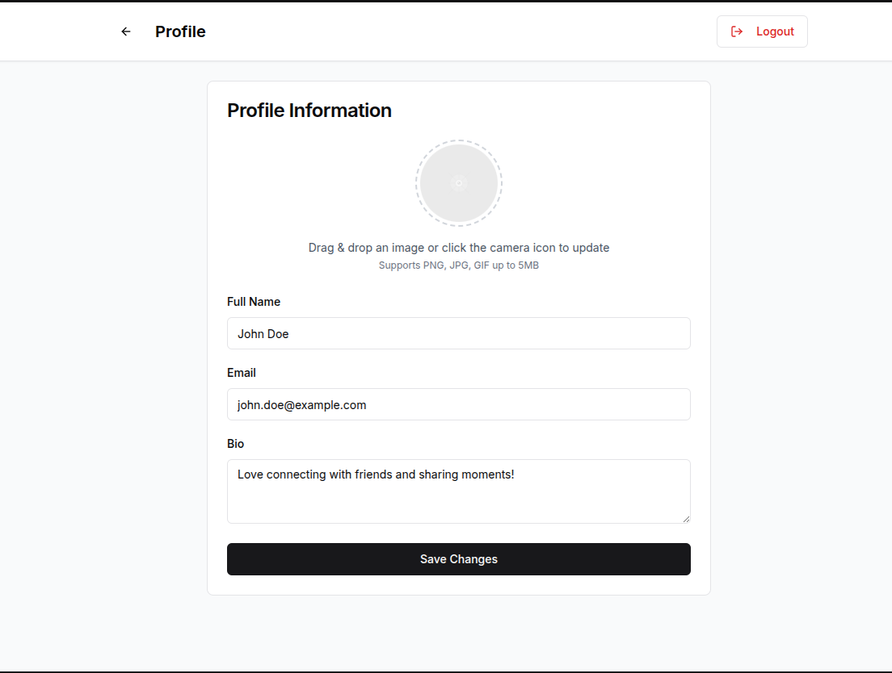

# 📬 Messaging-App

A full-stack, real-time messaging application built with Node.js, Express, React, and Socket.IO. This project features one-on-one and group conversations, a complete friendship system, and a modern, responsive user interface.

  
<sub>Light mode – 1-to-1 DM</sub>  

  
<sub>Gropu chat</sub>  

  
<sub>Drag-drop file sharing</sub>  

  
<sub>Edit Profile</sub>  

  
<sub>Add Users to Chat</sub>  

  
<sub>Manage friendship</sub>  

(See `/docs/screenshots` for more previews.)

---

## ✨ Features
- JWT authentication & profile management (avatar, bio)
- 1-to-1 and group conversations
- Real-time messaging with Socket.IO
- Typing indicators & online presence
- Infinite scroll (pagination) for chat history
- File / media attachments (S3 / Cloudinary)
- Optimistic UI & offline-first cache
- Postgres (Prisma)

---

## 🏗️ Tech Stack

| Front-end | Back-end | Infra |
|-----------|----------|-------|
| React 18 + Vite | Node 20 + Express | PostgreSQL |
| TailwindCSS + Radix UI | Prisma ORM | Redis |
| Socket.IO-client | Socket.IO v4 | S3 / Cloudinary |
| React-Query | Zod validation | Docker & Render |

---

## 🌳 Repository Layout (Monorepo)

```
messaging_app/
├─ .gitignore            # root (IDE, OS, env files)
├─ README.md
│
├─ client/               # React front-end
│   ├─ .gitignore
│   ├─ vite.config.ts
│   └─ …
│
└─ backend/              # Express API + Socket.IO
    ├─ .gitignore
    ├─ prisma/
    └─ src/
```


---

## 🚀 Quick Start (Local)

1. **Clone & install**

   ```bash
   git clone https://github.com/keshujangid/Chat_app.git
   cd Chat_app

   # back-end
   cd backend
   cp .env.example .env            # fill DB creds & JWT secret
   npm i
   npx prisma migrate dev --name init
   npm run dev                     # http://localhost:5000
   ```

   In a new terminal:

   ```bash
   # front-end
   cd Chat_app/client
   cp .env.example .env            # set VITE_API_URL & VITE_WS_URL
   npm i
   npm run dev                     # http://localhost:5173
   ```

2. **Create first users**

   Register two accounts in the UI, open two browser windows and start chatting ✨

---

## 🗄️ Environment Variables

### backend/.env

| Key | Example | Purpose |
|-----|---------|---------|
| NODE_ENV       | development |  |
| PORT           | 5000 | server port |
| DATABASE_URL   | postgres://user:pw@host/db | Prisma |
| JWT_SECRET     | supersecret123 | auth |
| REDIS_URL      | redis://localhost:6379 | presence (optional) |
| CLOUDINARY_CLOUD   | xxx | media upload |
| CLOUDINARY_KEY     | xxx | 〃 |
| CLOUDINARY_SECRET  | xxx | 〃 |

### client/.env

```
VITE_API_URL=http://localhost:5000
VITE_WS_URL=http://localhost:5000
```

---

## 📜 NPM Scripts

| Location | Script | What it does |
|----------|--------|--------------|
| client   | `npm run dev` | Vite dev server + HMR |
|          | `npm run build` | Production build to `dist/` |
| backend  | `npm run dev` | Nodemon + ts-node (auto-reload) |
|          | `npm run start` | Node in production mode |
| backend  | `npm run seed` | Seed users, chats, messages |
| root (optional) | `npm run docker:dev` | Compose Postgres + Redis |

---


## 🛣️ Roadmap

- [ ] Push notifications (Web Push + FCM)
- [ ] Message reactions & replies
- [ ] Read receipts
- [ ] Mobile app (React Native)

---

## 📝 License

MIT © 2025 Keshu Jangid

---

> Made with ☕ & 💬 – contributions and PRs welcome!